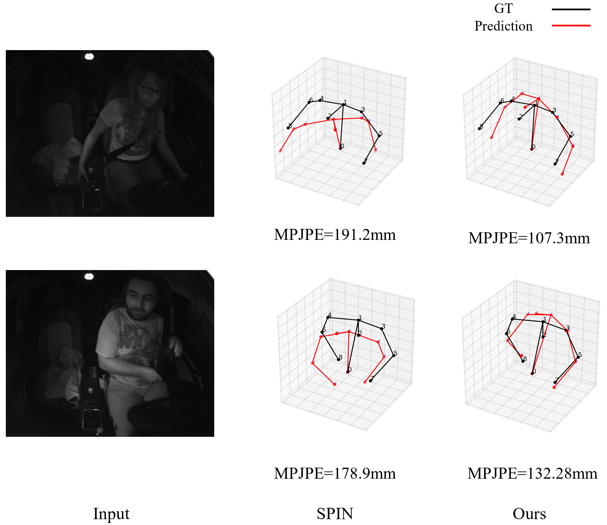

# Pose and Shape Estimation of Humans in Vehicles

Pose and Shape Estimation of Humans in Vehicles (paper link will be available)

> Kwang-Lim Ko, Jun-Sang Yoo, Changwoo Han, Jungyeop Kim, and Seung-Won Jung

## HIVE dataset

HIVE (Humans In VEhicle)

A synthetic dataset consists of synthesized humans with different shapes and poses in vehicels.

Download link will be available upon publication of our paper.

## In-vehicle human 3D joints

An in-vehicle human 3D joint dataset captured in real-world.

Download link will be available upon publication of our paper.

## Demo examples

The blue mesh represents the results from the SPIN (_Kolotouros et al_.) and the pink mesh represents the results from ours.

For each posture, the top parts are RGB images and the bottom parts are NIR images. 

---

---

---

---

## Ablation studies on Drive & Act dataset

For a cross-validation for other dataset, we applied our and compared models to the public dataset Drive&Act.

Table below shows the pose evaluation result on the real in-vehicle test set and Drive & Act dataset: The state-ofthe-art models are evaluated, and their fine-tuned models with the HIVE dataset are reported with †.

Our method shows the best performance on Drive&Act, and the performance of the other models is improved
when they are fine-tuned with the HIVE dataset.

|    | Drive & Act |   | In-vehicle test set (ours)| |

---

The figure below shows the examples of the visualized 3D joints estimated from SPIN and ours. The qualitative results display the effectiveness of our method.

